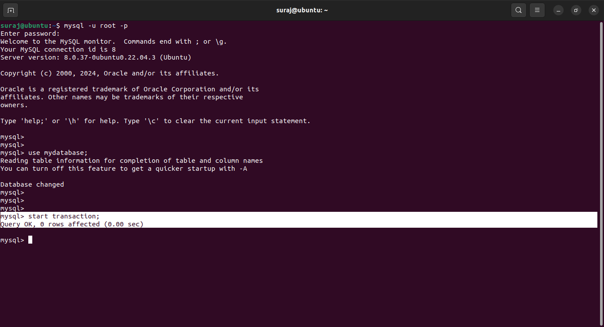

# Deadlock_Occurrence
  One of the most important concept in CS fundamental is deadlock occurrence that are found in Operating System,Database Management System,Distributed System,Real-time System    or Multithreaded Applications.
  Deadlock is occurs when set of processes are blocked because each process is holding a resource(CPU or some other resource) and is waiting for another resource that is held    by some different process, due to this none of the processes proceeds further with thier task forming a deadlock cycle and atlast leads the system to deadlock state.

# Deadlock Demonstration using Database System.

  ## Video Demonstration
  
  

  In Database System the deadlock can be implemented as,
  ## 1)Start two different transaction in two different terminal using the query .
      ex- start transaction;
      

  ## 2)Allocating Exclusive Locks on single record of the same entity(table) in each terminal using "for update" keyword in the query
      ex-  select * from student where rollno='12' for update;
      
  ## 3) Making Sure that the Exclusive lock is granted to each individual record of same entity in two different terminal using the below query.
      ex - select ENGINE_TRANSACTION_ID,LOCK_TYPE,LOCK_MODE,LOCK_STATUS,LOCK_DATA from performance_schema.data_locks;

  ## 4)Now Initiate the deadlock cycle as follows,
  ####   From 1st terminal request an Exclusive lock the on same record and data Item i.e hold by transaction in  2nd terminal.
            ex-  select * from student where rollno='12' for update;
  ####   Once the query the fired , the transaction from 1st terminal goes to WAITING STATE until the transaction from 2nd terminal i.e holding exclusive lock on same data              item,doesn't release the lock.
            Note- here the Input cursor of terminal would continue to blink.
  ####   From the 2nd terminal request an exlcusive lock on same record and data item  i.e hold by transaction of 1st terminal.
            Note - At this stage Deadlock cycle is formed.
  ####   On requesting Exclusive lock, the system end up with Deadlock sate due to formation of Deadlock cyclce with Message-
            ERROR 1213 (40001): Deadlock found when trying to get lock; try restarting transaction

    
