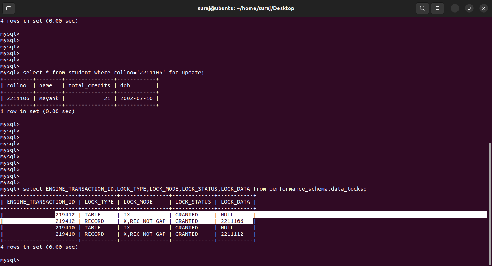

# Deadlock_Occurrence
  One of the most important concept in CS fundamental is deadlock occurrence that are found in Operating System,Database Management System,Distributed System,Real-time System    or Multithreaded Applications.
  Deadlock is occurs when set of processes are blocked because each process is holding a resource(CPU or some other resource) and is waiting for another resource that is held    by some different process, due to this none of the processes proceeds further with thier task forming a deadlock cycle and atlast leads the system to deadlock state.

# Deadlock Demonstration using Database System.

  ## Video Demonstration
  
  

  In Database System the deadlock can be implemented as,
  ## 1)Start two different transaction in two different terminal using the query .
      ex- start transaction;
  

  ## 2)Allocating Exclusive Locks on single record of the same entity(table) in each terminal using "for update" keyword in the query
      ex-  select * from student where rollno='12' for update;
      
  ## Requesting X(Exclusive) lock for Transaction T1 fromm 1st terminal.
  

  ## Requesting X(Exclusive) lock for Transaction T2 fromm 2nd terminal.
  

  ## 3) Making Sure that the Exclusive lock is granted to each individual record of same entity in two different terminal using the below query.
      ex - select ENGINE_TRANSACTION_ID,LOCK_TYPE,LOCK_MODE,LOCK_STATUS,LOCK_DATA from performance_schema.data_locks;
  ## Transaction T1 Lock Status from 1st terminal
  

  ## Transaction T2 Lock Status from 2nd terminal
  

  

  ## 4)Now Initiate the deadlock cycle as follows,
            ex-  select * from student where rollno='12' for update;
 ## From 2nd terminal Requesting X lock for Same record  and data item , i.e held by Transaction T1 of 1st terminal.
  
  ####   Once the query the fired , the transaction from 1st terminal goes to WAITING STATE until the transaction from 2nd terminal i.e holding exclusive lock on same data              item,doesn't release the lock.
            Note- here the Input cursor of terminal would continue to blink.

  ## View Lock Status of Transaction T2 in waiting state from 1st terminal.
   
                
            Note- On checking Lock,Transaction T2 of 2nd terminal would show Waiting, as the lock is already held by Transaction T1 of 1st terminal.

  ## From 1st terminal Requesting X lock for Same record  and data item , i.e held by Transaction T2 of 2nd terminal.
  
  ####   On requesting Exclusive lock, the system end up with Deadlock sate due to formation of Deadlock cyclce with Message-
            ERROR 1213 (40001): Deadlock found when trying to get lock; try restarting transaction

    
